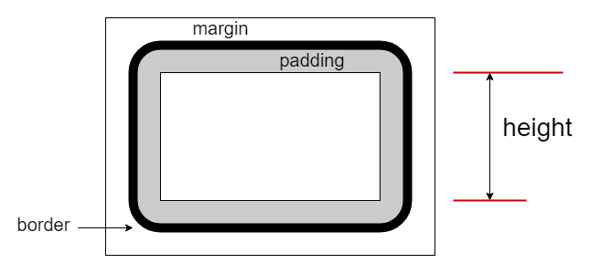

# $.height( el, val ): number | this

获取或设置 `el` 元素的内容高度，设置值可包含任意单位，纯数值视为像素（`px`），传递 `val` 值为一个空串或 `null` 会删除高度样式。获取的值为纯数值（像素单位），方便直接用于计算。

高度部分图示：



与 `$.width` 方法相同，始终针对元素的内容部分，与 `box-sizing` 值无关。

> **注：**<br>
> 如果 `el` 是文档对象（如 document）或窗口（如 window），可以获取其高度（但不可设置）。<br>
> 与 jQuery 稍有不同，jQuery 中 val 实参传递 null 并不会删除高度样式（只是忽略）。<br>

**背景知识：**

- `box-sizing` 值为 `content-box` 时： **CSS**: height = 内容高度（默认）
- `box-sizing` 值为 `border-box` 时：**CSS**: height = 内容高度 + padding宽度 + border宽度


## 参数

### el: {Element|Document|Window}

操作的目标元素或取值的文档对象或窗口实例。


### val: {Number|String|Function}

设置的高度值，可以是数值或带单位的字符串或取值回调。

回调接口：`function( curr-height ): String | Number`，函数内的 `this` 为当前的目标元素。


## 示例

```html
<section id="s0">
    <p>首个段落。</p>
    <p id="p2">第二个段落。</p>
    <p id="p3">The third paragraph.</p>
</section>
```


### 单元素版

```js
let sel = $.get('#s0');

$.height(sel);
// 94

$.height(sel, '90pt');
// <section id="s0" style="height: 90pt;">...</section>
// 注：样式值单位保持原样。

$.height(sel);
// 120
```

下面的取值与页面内容的多少和浏览器窗口大小有关，仅为示例。

```js
$.height(window);
// 1279
// 获取窗口的高度（文档的可视部分，不含滚动条）。

$.height(document);
// 3027
// 获取文档（页面内容）的完整高度，与滚动条无关。
```


### 集合版

```js
let ps = $('#s0 p');

ps.height();
// [20.6667, 20.6667, 20.6667]

ps.height('20pt');
ps.height();
// [26.6667, 26.6667, 26.6667]

ps.height([20, , '22pt']);
ps.height();
// [20, 26.6667, 29.3333]
// 注：第二个元素不做修改（undefined）。
```
