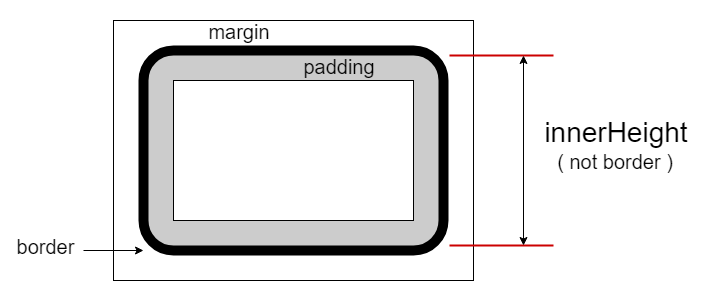

# $.innerHeight( el ): number

获取 `el` 元素的内部高度（包含 `padding` 部分但不包含 `border` 部分）。该接口不包含设置目标高度的功能，如果需要请使用 `$.height` 接口（需要减去 `padding` 部分）。

内部高度图示：




## 参数

### el: {Element|Document|Window}

取值的目标元素或文档对象（如 `document`）或窗口实例（如 `window`）。


## 示例

```html
<section id="s0" style="padding: 10px; height: 120px; border: 5px #ccc solid; width: 800px;">
    <p>首个段落。</p>
    <p id="p2">第二个段落。</p>
    <p id="p3">The third paragraph.</p>
</section>
```


### 单元素版

```js
let sel = $.get('#s0');

$.innerHeight(sel)
// 140

$.height(sel)
// 120


// 模拟 $.innerHeight(el, val) 设置功能。
// 设置 innerHeight 为200像素。
$.height(sel, h => 200 - ($.innerHeight(sel) - h) );

$.innerHeight(sel);
// 200

$.height(sel);
// 180
```

获取窗口或文档的内部高度（**注**：与调用 `.height` 效果相同）。

```js
$.innerHeight(window);
// 1279
// 注：不包含水平滚动条部分。

$.innerHeight(document);
// 3135
// 整个文档的高度，与滚动条无关。
```


### 集合版

```js

```
