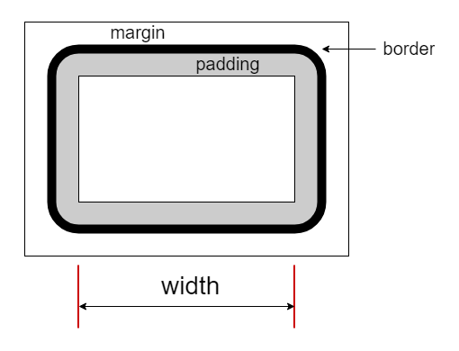

# $.width( el, val ): number | this

获取或设置 `el` 元素的内容宽度，设置值可包含任意单位，纯数值视为像素（`px`），传递 `val` 值为一个空串或 `null` 会删除宽度样式。获取的值为纯数值（像素单位），方便直接用于计算。

宽度部分图示：



与 `$.height` 方法相同，始终针对元素的内容部分，与 `box-sizing` 值无关。

> **注：**<br>
> 如果 `el` 是文档对象（如 document）或窗口（如 window），可以获取其宽度（但不可设置）。<br>
> 与 jQuery 稍有不同，jQuery 中 val 实参传递 null 并不会删除宽度样式。<br>

**背景知识：**

- `box-sizing` 值为 `content-box` 时： **CSS**: width = 内容宽度（默认）
- `box-sizing` 值为 `border-box` 时：**CSS**: width = 内容宽度 + padding宽度 + border宽度


## 参数

### el: {Element|Document|Window}

操作的目标元素或取值的文档对象或窗口实例。


### val: {Number|String|Function}

设置的宽度值，可以是数值或带单位的字符串或取值回调。

回调接口：`function( curr-width ): String | Number`，函数内的 `this` 为当前的目标元素。


## 示例

```html
<section id="s0" style="800px;">
    <p>首个段落。</p>
    <p id="p2">第二个段落。</p>
    <p id="p3">The third paragraph.</p>
</section>
```


### 单元素版

```js
let sel = $.get('#s0');

$.width(sel);
// 800

$.width(sel, '40em');
// <section id="s0" style="width: 40em;">...</section>
// 注：样式值单位保持原样。

$.width(sel);
// 640
```

下面的取值与页面内容的定制宽度和浏览器窗口宽度有关，通常两者一致（没有水平滚动条）。

```js
$.width(window);
// 963
// 获取窗口的宽度（文档的可视部分，不含滚动条）。

$.width(document);
// 963
// 获取文档（页面内容）的完整宽度，与滚动条无关。
```


### 集合版

```js
let ps = $('#s0 p');

ps.width();
// [800, 800, 800]

ps.width(['40em', 700]);
ps.width();
// [640, 700, 800]
// 注：末尾的元素没有对应值，被忽略。

ps.width('50em');
ps.width();
// [800, 800, 800]
// 注：这里 50em 对应到 800px。
```
